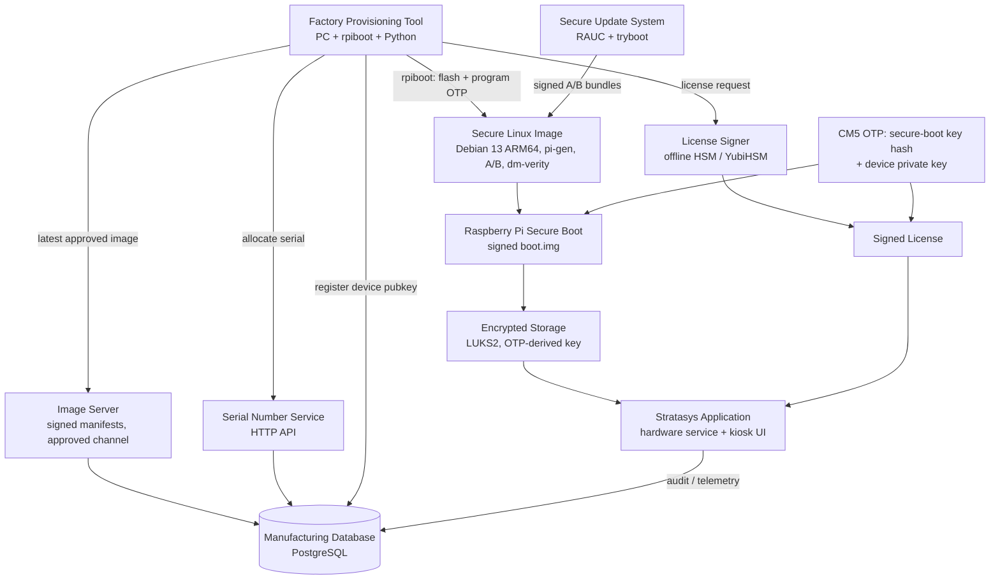
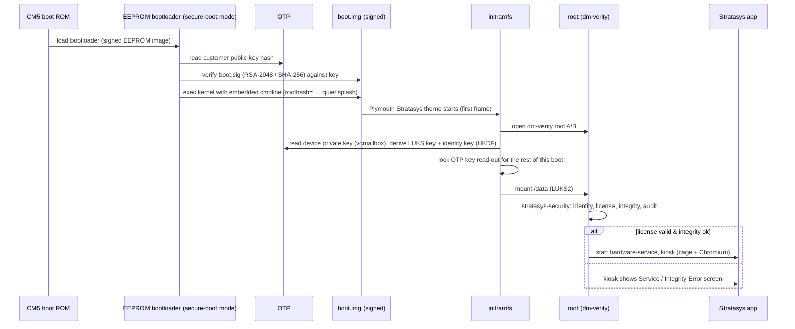
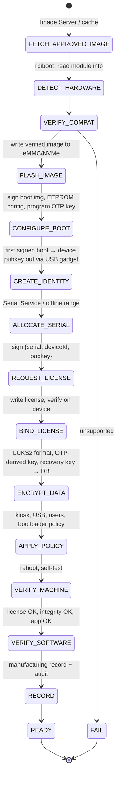
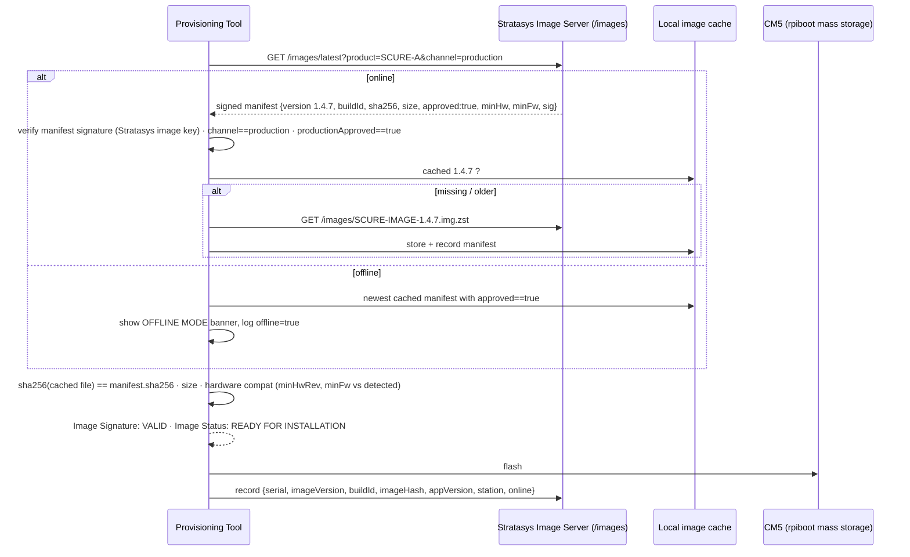

# Stratasys Secure Linux Appliance — System Architecture

Version 0.2 · 2026-08-25 · Phases 1, 3–10 of the appliance program
(Phase 2, the threat model, is in [THREAT-MODEL.md](THREAT-MODEL.md);
Phase 11, the implementation, lives in the sibling directories of `appliance/`.)

> **Target platform: Raspberry Pi Compute Module 5 (CM5)** on the Stratasys
> carrier board, ARM64, eMMC or NVMe storage. Provisioning is done by
> connecting the CM5 (carrier in `nRPIBOOT` mode) over USB to the factory
> provisioning PC: the PC runs Raspberry Pi `rpiboot`, the module's storage
> appears as a USB disk, the tool flashes the approved image, programs the
> one-time-programmable (OTP) secure-boot key, provisions identity, serial
> and license, and verifies the unit — all from the PC.
> The "Stratasys application" is the sCure controller stack already in this
> repository (Flask hardware service on :3001 + Chromium kiosk UI).
> An x86/UEFI/TPM variant of this design is kept in §12 for other products.

---

## 0. Executive summary

| Decision | Choice | One-line reason |
|---|---|---|
| Base distribution | **Debian 13 (trixie) ARM64 built with `pi-gen`** (Raspberry Pi's official builder) with Stratasys stages | Same base as the current test machine; Raspberry Pi kernel/firmware packages maintained upstream; reproducible image from a stage directory |
| Boot chain | **Raspberry Pi Secure Boot**: EEPROM bootloader → verifies RSA-2048-signed `boot.img` (kernel + initramfs + config) against the customer public-key hash burned into **OTP** | Only Stratasys-signed boot images run; irreversible once the OTP is programmed |
| Root filesystem | **Read-only, dm-verity protected, A/B** (`root-a`/`root-b` + verity partitions), root hash carried in the signed `boot.img` cmdline | Any byte changed offline or online fails the boot or the read |
| Persistent data | **LUKS2 partition**, key derived from the CM5's **OTP device-specific private key** (readable only by the signed initramfs; hidden from the OS afterwards) plus a Stratasys recovery key | Storage removed = ciphertext; boots with no password on the authorized module only |
| Device identity | **Per-module ECC P-256 key** derived deterministically from the OTP private key inside the signed initramfs (HKDF), private half never written to disk; optional **SPI TPM 2.0** (Infineon SLB9670/9672) on the carrier for HSM-grade keys | Cannot be copied with the disk image; bound to the silicon |
| License | **Ed25519-signed JSON** (Stratasys offline signing key; device only holds the public key) bound to device ID + serial | No shared secret exists on the machine |
| Serial numbers | **Central Serial Service** (HTTP + PostgreSQL, `SELECT … FOR UPDATE` counter) with **signed pre-allocated ranges** for offline stations | Atomic, never reused, works without network |
| Approved image | Tool always asks the **Image Server** for the latest *Production-Approved* signed manifest; local cache; offline mode flagged | Never flashes a dev build by accident |
| Kiosk | **cage** (single-app Wayland compositor) → Chromium `--kiosk` on `http://127.0.0.1:3001`, no display manager, no desktop | Nothing to Alt-Tab to |
| Updates | **RAUC** A/B bundles using the Pi bootloader's **`tryboot`** slot switch, signed manifests, automatic fallback, anti-rollback version floor | Atomic, verified, self-healing, official Pi mechanism |
| Service access | Short-lived **SSH certificates** (per-serial, per-engineer, 8 h) + per-machine daily service PIN in the app; no static root password | Auditable, revocable, unique per machine |

---

## 1. Phase 1 — System architecture

### 1.1 Component relationship



### 1.2 Runtime layers on the appliance

```mermaid
flowchart LR
    subgraph HW[CM5 silicon]
        ROM[Boot ROM]
        EEPROM[EEPROM bootloader<br/>signed, secure-boot mode]
        OTPK[OTP: pubkey hash, device key]
    end
    subgraph BOOT[boot.img — signed, verified]
        KRN[kernel + DTB + config.txt]
        INITRD[initramfs: verity + LUKS unlock,<br/>identity derivation, Plymouth splash]
    end
    subgraph OS[Operating system]
        VER[root A / root B<br/>dm-verity, read-only]
        DATA[/var + /data<br/>LUKS2]
        SYSD[systemd: supervision, sandboxing]
    end
    subgraph SVC[Stratasys services — least privilege]
        SEC[security-service<br/>license, identity, integrity, audit]
        HWS[hardware-service<br/>io_controller / machine control]
        CFG[config-service]
        UPDS[update-service RAUC]
        LOG[logging-service]
    end
    subgraph UI[Kiosk]
        CAGE[cage compositor]
        CHR[Chromium --kiosk]
    end
    ROM --> EEPROM --> KRN --> INITRD --> VER --> SYSD
    OTPK -. verifies .-> EEPROM
    OTPK -. unlock key .-> INITRD
    INITRD -. device key .-> SEC
    SYSD --> SEC --> HWS --> CHR
    SYSD --> CFG & UPDS & LOG
    CAGE --> CHR
```

### 1.3 Storage layout (eMMC / NVMe, MBR or GPT — the Pi bootloader supports both; GPT used)

| # | Partition | Type / size | Content | Protection |
|---|---|---|---|---|
| 1 | `boot-a` | FAT32, 256 MiB | `boot.img` (signed: kernel, DTBs, overlays, initramfs, `config.txt`, `cmdline.txt` with `roothash=`), `boot.sig` | RSA-2048 signature verified by the EEPROM against the OTP key hash |
| 2 | `boot-b` | FAT32, 256 MiB | second boot slot | same |
| 3 | `root-a` | erofs, 3 GiB | Debian + Stratasys app, read-only | dm-verity |
| 4 | `verity-a` | 48 MiB | hash tree | root hash inside signed `boot.img` |
| 5 | `root-b` | 3 GiB | | dm-verity |
| 6 | `verity-b` | 48 MiB | | |
| 7 | `data` | LUKS2, rest | `/var`, `/data` (app data, logs, config, license, audit, RAUC status) | OTP-derived key + Stratasys recovery key |

`autoboot.txt` on the first FAT partition selects the slot: `[all] tryboot_a_b=1 boot_partition=1` / `[tryboot] boot_partition=2` — the Pi firmware's native A/B mechanism (RAUC drives it). The root hash of the active slot travels inside the signed `boot.img` command line, so the kernel refuses a root filesystem that does not match the signature chain — that is the integrity mechanism for every application binary (§22).

### 1.4 Service decomposition (least privilege)

| Service | Runs as | Privileges | Talks to |
|---|---|---|---|
| `stratasys-security` | `security` | reads the derived device key handed over by the initramfs via a `0400` tmpfs file that it consumes and shreds at start; writes audit log (append-only dir); optional `tss` group for SPI TPM | Unix socket `/run/stratasys/security.sock` |
| `stratasys-hardware` (existing Flask `app.py` + `io_controller`) | `hardware` | `i2c`, `gpio`, `spi`, `dialout` groups | HTTP 127.0.0.1:3001, security socket |
| `stratasys-config` | `config` | write `/data/config` only | socket |
| `stratasys-update` (RAUC) | `root` — **the only privileged service**; `ProtectSystem=strict`, minimal capability set | block devices of the inactive slot, `autoboot.txt` | socket, USB / HTTPS |
| `stratasys-logging` | `logging` | journald forwarding, rotation | socket |
| `stratasys-kiosk` | `kiosk` | seat via `logind`; `nologin`; no sudo | display |

All services use systemd hardening (`NoNewPrivileges`, `ProtectHome`, `PrivateTmp`, `RestrictAddressFamilies`, `SystemCallFilter=@system-service`). See `appliance/image/stage-stratasys/files/usr/lib/systemd/system/`.

---

## 2. Phase 3 — Linux distribution selection

| Criterion | Ubuntu (Server / Core for Pi) | Debian 13 / Raspberry Pi OS via `pi-gen` | Yocto (meta-raspberrypi) |
|---|---|---|---|
| Development effort | Medium; Ubuntu's Pi kernel lags RPi features (CM5 support, tryboot integration) | **Low–medium**: official builder, official kernel/firmware/EEPROM packages, `stage` dirs = shell scripts | High; BSP layer exists but CM5/Pi 5 support arrives later and every package is yours to maintain |
| Maintainability | Good; Core needs snap infrastructure | **Good**: Debian security team + Raspberry Pi kernel/firmware updates via apt at build time | You are the distro |
| Boot customization (signed boot.img, splash) | Possible, custom work | **Native**: `rpi-eeprom`, `rpi-sign-bootloader`, `usbboot` tooling target exactly this flow | Possible, hand-integrated |
| Kiosk support | cage/weston available | **cage / labwc / wayfire in apt**; Raspberry Pi's own kiosk guidance uses them | Available, more integration |
| Security (secure boot, verity, LUKS) | Same kernel features | **Good**: `cryptsetup`, `veritysetup`, initramfs-tools hooks; RPi secure-boot docs are Debian-based | Best granularity |
| Update architecture | snaps or custom | **RAUC** (`rauc` package, Pi `tryboot` support upstream) | RAUC/SWUpdate native |
| Package control / surface | Medium | **Good** (`pi-gen` lite stages only + our stage, ~600 MB root) | **Best** |
| Image size | 2 GB+ | **~1 GB** | 300–500 MB |
| Long-term maintenance | 5 y | **~5 y per Debian release** | 2 y LTS |
| Suitability for industrial embedded on CM5 | Good | **Best fit for a Raspberry Pi-based product** (vendor-supported path) | Best for custom SoCs; over-engineering here |

**Recommendation: Debian 13 (trixie) ARM64 built with `pi-gen`, Raspberry Pi OS Lite base stages + a `stage-stratasys` stage.** It is the vendor-supported path for CM5 secure boot, tryboot A/B and EEPROM tooling; it matches the software already running on the test machine; and the whole image is a directory of shell stages a small team can own. Yocto is kept as the migration path if a non-Pi SoC is ever chosen.

---

## 3. Phase 4 — Boot architecture

### 3.1 Raspberry Pi Secure Boot chain



- **Programming the OTP** happens once per module during provisioning from the PC (`rpiboot` with a `secure-boot-recovery` payload: `program_pubkey=1`, `revoke_devkey=1` to disable Raspberry Pi's development key, `program_jtag_lock=1`). **Irreversible**: after this the module only boots a Stratasys-signed `boot.img`; an unsigned SD/USB/NVMe image is refused by the bootloader itself (Scenarios H, K).
- `boot.img` is a FAT image containing kernel, DTBs, initramfs, `config.txt`, `cmdline.txt`; `boot.sig` = SHA-256 + RSA signature made by the offline **boot-signing key** (HSM). The `cmdline.txt` inside it is therefore signed — no editable boot menu exists on a Pi at all.
- `config.txt`: `disable_splash=1` (no rainbow square), `boot_delay=0`, `uart_2ndstage=0`, `enable_uart=0`, `dtparam=…` for the carrier; `bootloader config` (in EEPROM, signed): `BOOT_ORDER=0x1` (SD/eMMC only, **USB and network boot disabled**), `ENABLE_SELF_UPDATE=0`, `POWER_OFF_ON_HALT=1`, `DISABLE_HDMI=0`. Because the EEPROM config is part of the signed EEPROM image, an attacker cannot change the boot order.

### 3.2 What the operator sees

`quiet splash loglevel=0 rd.udev.log_level=0 vt.global_cursor_default=0 systemd.show_status=false console=` — inside the signed `boot.img`.

1. Nothing from the firmware (`disable_splash=1`, HDMI stays black ~1 s).
2. Plymouth **Stratasys theme** (logo + "Starting system…" + progress) from the initramfs, i.e. before the root filesystem is even opened.
3. Plymouth hands off to `cage`; Chromium shows the same logo page until `/api/state` answers; then the application.

No getty on any VT; `kernel.sysrq=0`; `ctrl-alt-del.target` masked; serial console disabled in both kernel cmdline and `config.txt`.

### 3.2b Display — everything is inside the image

| Setting | Where it lives | Value (sCure) |
|---|---|---|
| Panel | signed `config.txt` via `image/display-profiles/<profile>.conf` (`DISPLAY_PROFILE` at `make-boot-img.sh` time) | `dsi-touch-display-2`: `dtoverlay=vc4-kms-dsi-ili9881-7-0` + touch axis swap/invert; `hdmi-1280x720` for the bench |
| Mode + rotation | signed `cmdline.txt` `video=DSI-1:720x1280@60,rotate=90` | landscape from the first Plymouth frame; cage/wlroots reads the same rotation for touch mapping |
| Firmware output | `disable_splash=1`, `avoid_warnings=2`, `disable_overscan=1`, `display_auto_detect=1` | black until Plymouth |
| Splash | Plymouth theme `stratasys` in the **initramfs** (`FRAMEBUFFER=y`): logo, "Starting system…", progress bar; also renders "Service required (E-…)" messages | `files/usr/share/plymouth/themes/stratasys/` |
| Hand-over | `stratasys-kiosk.service`: `plymouth deactivate` → cage → Chromium opens `loading.html` (same look, polls `/api/state`) → `plymouth quit` → app | no black frame, no distro screen anywhere |
| Cursor | `vt.global_cursor_default=0`, `WLR_NO_HARDWARE_CURSORS=1`, `XCURSOR_SIZE=1`, app CSS `cursor:none` | touch panel, never a pointer |
| Blanking | `consoleblank=0`, no DPMS in cage; the app's own 2-min screensaver / WakeScreen handles idle | screen never blanks on its own |
| Touch | Chromium `--touch-events=enabled`, `--disable-pinch`, `--overscroll-history-navigation=0` | no zoom / swipe-back |
| Backlight | udev `70-stratasys-display.rules` gives `hardware` write access to `/sys/class/backlight/*` | app can dim/wake the panel |
| Scaling | app `fitToScreen()` stretches the 800×480 design canvas to the panel (1280×720) | unchanged |
| Chromium policy | `URLAllowlist` = app + `file:///usr/share/stratasys/loading.html` only | nothing else can be shown |

Changing the panel for another product = a new `display-profiles/*.conf`; no image rebuild logic changes.

### 3.3 Kiosk

- `stratasys-kiosk.service` (`After=stratasys-hardware.service`, `Restart=always`, `RestartSec=2`, `StartLimitIntervalSec=0`) runs `cage -- chromium --kiosk --noerrdialogs --no-first-run --disable-pinch --overscroll-history-navigation=0 --disable-features=TranslateUI --app=http://127.0.0.1:3001` as user `kiosk`.
- `cage` shows exactly one client full-screen; there is no window manager, launcher or desktop behind it — Alt-Tab, Super, Alt-F4 have no target. Chromium hotkeys are removed with a managed **policy** (`/etc/chromium/policies/managed/stratasys.json`: `DeveloperToolsAvailability=2`, `URLBlocklist=["*"]`, `URLAllowlist=["http://127.0.0.1:3001"]`, `IncognitoModeAvailability=1`, `BrowserSignin=0`, `PrintingEnabled=false`, `DownloadRestrictions=3`).
- VT switching is blocked at the compositor and by `logind` (`NAutoVTs=0`, `ReserveVT=0`).
- Crash → systemd restarts the unit in 2 s; `WatchdogSec=30` + `sd_notify` restarts a hung hardware service; the BCM2712 hardware watchdog (`RuntimeWatchdogSec=15` in `system.conf`) reboots a hung kernel.

---

## 4. Phase 5 — Factory provisioning

### 4.1 Station

A factory PC (Linux or Windows) with the **Stratasys Factory Provisioning Tool** (`appliance/provisioning-tool/`, Python + Textual TUI) and Raspberry Pi `rpiboot`/`usbboot`. The CM5 carrier is connected by USB with `nRPIBOOT` asserted (jumper or the carrier's provisioning switch).

### 4.2 Flow (state machine)



Every step is idempotent and journaled to `provisioning.jsonl` on the station so a power loss resumes at the last completed step; the serial number is only *committed* in the DB after `RECORD` (allocation state `RESERVED` → `ASSIGNED`).

**How the PC talks to the module after flashing.** Steps up to `CONFIGURE_BOOT` use the module's storage as a USB disk (mass-storage gadget loaded by `rpiboot`). From `CREATE_IDENTITY` on, the module boots its own signed image in **provisioning mode**: the initramfs detects the `nRPIBOOT`-style provisioning flag (a file the tool leaves in `boot-a`, valid only until first successful RECORD and only when the image is a factory build) and brings up a **USB Ethernet gadget** (`g_ether` / CDC-NCM, link-local address); the tool then speaks a small authenticated HTTP API on the module (`stratasys-provisioning-agent`, present only while the provisioning flag exists) to fetch the device public key, push the license, run self-tests, and finally delete the flag — after which the agent never starts again.

### 4.3 Hardware detection & compatibility

`rpiboot` reports board revision, serial and memory; the agent reports EEPROM version, OTP state (`vcgencmd otp_dump`), storage type/size, carrier EEPROM ID (the Stratasys carrier exposes an I²C EEPROM with its revision), attached I/O board IDs. `hardware-profiles.yaml` lists supported CM5 variants (RAM/eMMC/wireless), minimum EEPROM version, required carrier revision, minimum storage. Unknown-but-compatible combinations only with a supervisor override, recorded in the audit log.

### 4.4 Serial number allocation (§5–8)

- Format `SC` + 6 digits, ascending, never reused, generated by **one** counter: `serial_counter` table in the manufacturing DB, incremented inside a transaction with `SELECT … FOR UPDATE` (see `serial-service/`). Two stations cannot get the same number — the row lock serialises them.
- `POST /serials/allocate` returns `{serial, allocationId, reservedUntil}`; the station confirms with `POST /serials/{serial}/commit` after RECORD. Uncommitted reservations expire but the number is **still burned** (the counter never moves backwards); it is recorded as `VOID` for traceability.
- **Generate New Serial Number** (authorised operator, role `factory` or `service`): `POST /serials/allocate` with `reason` + `previousSerial`; the DB stores the chain (`previous_serial`) and an audit row; the device's serial is re-issued through the license flow (a serial is only valid together with a license that names it — nobody can just edit a file; see §6).
- **Offline provisioning — preferred approach: signed pre-allocated ranges.** Before going offline a station requests `POST /serials/ranges {size: 50}` → the service *burns* 50 numbers immediately and returns a **signed range token** (`{stationId, first, last, issuedAt, expiresAt}`). The offline station consumes numbers strictly ascending and records each in a local signed ledger; on reconnect it uploads the ledger, the DB marks used numbers `ASSIGNED` and the remainder `VOID`. *Limitations*: a lost ledger leaves a gap (gaps are acceptable, duplicates are not); ranges expire (14 days) so they cannot be hoarded; offline units get a **provisional license** signed by a *station key* (30-day validity) replaced by a full license at first sync — we do **not** put the Stratasys license private key on a factory laptop. Rejected alternatives: a factory-local server (just "online" with a different network), letting the station invent numbers (no uniqueness guarantee).

### 4.5 Approved production image — automatic latest-approved installation

The station never flashes "whatever image is on the stick". Before each unit:



- **Channels**: `development`, `qa`, `production`. Only manifests with `channel == "production"` **and** `productionApproved == true` are installable by the Factory tool; `qa`/`development` are selectable only with `--channel` under the `engineering` role and are stamped `NON-PRODUCTION` in the DB and on the unit's license (`features` excludes `production`).
- **Manifest** (`common/manifests.py`): `{imageVersion, buildId, product, channel, sha256, sizeBytes, releaseDate, minHardwareRevision, requiredFirmwareVersion, productionApproved, appVersion, url}` + Ed25519 signature. Rejected if: signature invalid, signer not trusted, hash mismatch, size mismatch, not approved, wrong product, hardware below `minHardwareRevision`, EEPROM below `requiredFirmwareVersion`, or the build is on the server's **withdrawn** list.
- **Cache**: `~/.cache/stratasys-images/<buildId>/{image.img.zst, manifest.json}`; re-verified (signature + SHA-256) before **every** flash; a corrupted cache file is deleted and re-downloaded. Units 2–50 use the cache; the tool still asks the server each time whether a newer approved version exists.
- **Offline**: newest cached approved manifest; UI shows `OFFLINE MODE — Unable to verify whether a newer Production Image is available. Using cached approved image: 1.4.7`; the record stores `provisioningStatus: "offline"`; pending records upload on reconnect, with a warning if the version was withdrawn meanwhile.
- **Traceability per unit**: serial, image version, app version, build ID, image hash, provisioning date, station ID, online/offline — `provisioning_runs` table.
- The Image Server is the same service as the Serial Service (`serial-service/`, routes under `/images`); images are static files on an HTTPS origin referenced by URL in the manifest.

### 4.6 Manufacturing database (§27)

PostgreSQL schema in `serial-service/schema.sql`: `machines`, `serial_counter`, `serial_allocations` (state, previous_serial, station, reason), `serial_ranges`, `devices` (device_id, public key PEM, board serial, OTP state, hardware fingerprint), `licenses` (version, features, signature, revoked), `images` (manifests, approval state, withdrawn), `provisioning_runs` (station, image version/build/hash, app version, online/offline, step log, result), `audit_log` (append-only, hash-chained), `update_history`, `recovery_keys` (LUKS recovery key **encrypted** to the Stratasys service KMS key), `bootloader_config` (per-unit EEPROM config hash).

---

## 5. Phase 6 — Device identity

1. **Silicon root**: every CM5 has a 32-byte **device-specific private key in OTP** (Raspberry Pi 4/5 family feature, `rpi-otp-private-key`). In secure-boot mode the signed initramfs reads it through the VideoCore mailbox and then **locks read-out** for the rest of the boot, so the running OS (and any attacker with root) cannot read it. If the carrier carries an **SPI TPM 2.0** (recommended for the production carrier revision), the identity key is instead created inside the TPM (`fixedtpm|fixedparent`, non-exportable) and the OTP key only derives the LUKS secret.
2. **Identity key**: `HKDF-SHA256(otp_key, info="stratasys-identity-v1")` → ECC P-256 private scalar, computed in the initramfs; the public key is handed to `stratasys-security` on a `0400` tmpfs that it consumes and shreds; the private scalar never touches persistent storage. Signing challenges for the license check happen in the security service's memory only.
3. **Device ID** = `"DEV-" + base32(sha256(SubjectPublicKeyInfo DER))[:26]` — deterministic from the public key, so DB, license and machine always agree.
4. During provisioning the module proves possession by signing a nonce (`POST /devices/register {pubkey, boardSerial, signature(nonce)}`); the DB records the board serial and OTP secure-boot state.
5. **Hardware fingerprint** (secondary): SHA-256 over `{board serial, board revision, storage serial, carrier EEPROM id}` — stored for service/traceability and a *soft* check in the license (a replaced NVMe must not brick the machine; a replaced module *does* require re-provisioning — the identity moved with the silicon).
6. **Lab modules without secure boot / OTP programming**: software identity in `/data/identity/` with `"identityBackend":"software"`; the app shows a permanent "Development identity" badge; production licenses are never issued for software identities.

Relationship (§29): `serial SC000126` (human) ↔ `deviceId DEV-…` (derived from the silicon key) ↔ `license` (signed statement binding them). Changing any one without Stratasys' signing key makes the set inconsistent and the app refuses Production Mode.

---

## 6. Phase 7 — Licensing

### 6.1 Format (`license-tool/`)

```json
{
  "payload": {
    "licenseVersion": 1,
    "serial": "SC000126",
    "previousSerial": "SC000125",
    "deviceId": "DEV-Q7HK2M…",
    "devicePublicKey": "-----BEGIN PUBLIC KEY-----…",
    "identityBackend": "otp-hkdf",
    "productType": "SCURE-A",
    "features": ["production", "bleaching", "nitrogen"],
    "softwareCompat": ">=0.6.0 <2.0.0",
    "issuedAt": "2026-08-25T10:12:00Z",
    "notBefore": "2026-08-25T00:00:00Z",
    "expiresAt": null,
    "issuer": "stratasys-license-ca-2026",
    "nonce": "…"
  },
  "signature": "base64(Ed25519 over canonical JSON of payload)",
  "signerKeyId": "…"
}
```

- Canonical JSON (sorted keys, no whitespace) → Ed25519. The appliance holds only `/usr/share/stratasys/keys/license-*.pub` (inside the dm-verity root, so the public key cannot be swapped). Several keys may be present; revoked key IDs are listed in the image.
- **Verification at every boot and every 10 min** by `stratasys-security`: signature → `deviceId` equals the ID recomputed from the live identity public key → the identity key signs a fresh challenge → `serial` equals the cached serial → `softwareCompat` → `notBefore/expiresAt` → fingerprint soft check. Any failure → `LICENSE_INVALID` → kiosk shows the **License / Service screen**; hardware outputs stay in safe state.
- Copying `/data` to another module fails at the device-ID/challenge steps (different silicon key). Copying the whole storage fails earlier (LUKS key derived from the original OTP key). Editing the serial fails at the serial step.
- The private signing key lives in an offline signer (YubiHSM 2 / KMS with approval); the Serial Service submits signing requests; the factory never sees the key.

### 6.2 Security decision record

| | |
|---|---|
| Recommended | Ed25519 signed license, silicon-bound device ID, challenge-response at runtime |
| Why | No secret on the device; offline verifiable; tiny signatures; `cryptography` available on both sides |
| Advantages | Duplication useless without the module's OTP key; revocation by key rotation or per-license revocation list in updates |
| Disadvantages | Module replacement = re-provision; lab modules need a weaker path; the OTP-derived key is protected by *secure boot* (read-out lock), so the two features must ship together |
| Security level | High against user/admin/storage theft; medium-high against a skilled attacker (no external bus to sniff — the key is inside the SoC) |
| Hardware | CM5 with OTP programmed; optional SPI TPM 2.0 for HSM-grade key storage |
| Manufacturing | +~30 s per unit; Serial Service reachability or range token |
| Service | Re-licensing after module swap is a Service-Mode operation with a Stratasys-issued license |
| Residual | Firmware-level compromise of the VideoCore/bootloader; a runtime memory dump of the app (yields the app, not the license key) |

---

## 7. Phase 8 — Filesystem security

| Layer | Mechanism | Protects against |
|---|---|---|
| Root (`/usr`, `/etc`, app, public keys) | erofs, **dm-verity**, root hash in signed `boot.img` cmdline | Any modification (G) |
| `/data`, `/var` | **LUKS2 (aes-xts-plain64, argon2id)**; slot 0 = key derived in the signed initramfs from the OTP key (`HKDF(otp_key, "stratasys-luks-v1")`), never stored; slot 1 = Stratasys recovery passphrase (escrowed encrypted in the DB) | Storage removal (B, C, L); reading keys offline (J) |
| Secrets inside `/data` (license, service certificates, calibration) | `0400`, owner `security`; group-less | Root-less processes; casual access |
| Proprietary algorithms | inside the verity root, packaged as compiled + stripped modules (Cython / Rust) | Casual inspection only — obfuscation, not a barrier (see threat model) |
| Permissions | dedicated system users per service; `kiosk` `nologin`; no `sudo` package; `root` locked | A |
| Immutability | `/usr` verity; no package manager in the image (`apt` removed by the last stage); machine-specific settings only in `/data/config` (bind-mounted) | Unauthorised install / persistence |
| Integrity screen | `stratasys-security` re-hashes a manifest of app files at start; on failure `integrity=failed` → kiosk `/service/integrity-error` | G with a clear operator message |
| Hardware crypto | BCM2712 has ARMv8 crypto extensions: AES-XTS on LUKS costs <10 % of eMMC bandwidth | performance |

**Why not encrypt root too?** Root is public Debian + our app; verity already stops modification, and encryption would only obscure binaries a skilled attacker with the running machine can obtain anyway. Keeping root plain keeps A/B updates simple and lets Plymouth start before any key derivation. All *secrets* are in encrypted `/data`.

---

## 8. Phase 9 — Secure update

### 8.1 Design

- **RAUC** with the Raspberry Pi `tryboot` bootloader backend: `system.conf` defines slots `boot.0/boot.1` (FAT, `boot.img`+`boot.sig`), `rootfs.0/rootfs.1` (erofs), `verity.0/verity.1`. A bundle (`.raucb`) contains the three images and a **signed manifest** (X.509/CMS — RAUC's native format — with the certificate chained to the Stratasys update CA whose root certificate is inside the verity root). The existing `.scu` USB workflow becomes "a `.raucb` on a USB stick"; HTTPS streaming install is also supported by RAUC.
- Install writes only the **inactive** slot, then sets `tryboot` for it; the Pi firmware boots it exactly once; `stratasys-security` marks the boot good (`rauc status mark-good`) only after license OK + integrity OK + app healthy for 60 s, which makes the slot permanent (`autoboot.txt` rewritten); otherwise the next reset boots the previous slot automatically.
- **Anti-rollback**: the security service keeps `min_version` in `/data/security/min-version` (and, on carriers with a TPM, in an NV counter); an update's manifest may raise the floor; older-than-floor bundles are refused even if correctly signed.
- Traceability: every update start/success/rollback is an audit event with old/new version, source, signer; uploaded to `update_history` when online.

### 8.2 Decision record

| | |
|---|---|
| Recommended | RAUC A/B + tryboot + CMS-signed bundles + boot-once + version floor |
| Why | Official Pi A/B mechanism; RAUC is the standard embedded updater with it; atomic; USB and network with one format |
| Disadvantages | Whole-image bundles (~700 MB) rather than deltas — acceptable at this scale; RAUC's `casync` delta support can be added later |
| Security level | High (signed, verified before write, rollback-safe) |
| Manufacturing | The factory image and the update bundle come from the same `pi-gen` build |
| Service | Service Mode can install a *signed* diagnostic bundle the same way; nothing unsigned ever installs |
| Residual | Compromise of the update CA (HSM + rotation); physical re-flash via `rpiboot` needs the module in `nRPIBOOT` mode **and** a Stratasys-signed image (secure boot) — an unsigned re-flash does not boot |

---

## 9. Phase 10 — Service and recovery

### 9.1 Roles (§20)

| Role | Authenticated by | Gets | Logged |
|---|---|---|---|
| Production user | none (kiosk) | the app only | app audit events |
| Service user | **Service PIN screen** in the app (10× on Settings → PIN — same UX as the current Developer Mode) with a **per-machine daily PIN** computed on the Stratasys service portal from `serial + date` (HMAC, 8 digits, valid 24 h); the device verifies with the same derivation from a per-device secret that was sealed into `/data` at provisioning — no static PIN exists | Service screens: logs, diagnostics, network, versions, calibration, controlled tools, export | yes |
| Developer / Factory user | **SSH certificate** from the Stratasys SSH CA to a named engineer, `principal=<serial>` or `factory`, valid 8 h; `sshd` runs **only** while a Service window is open (30 min) on the USB-gadget / link-local interface, never on the customer LAN by default | shell as `service`; `sudo` for an allow-listed command set with `log_output` | yes, with certificate identity |
| root | locked; no interactive login anywhere | only via allow-listed `sudo` by certificate-authenticated users | |

No shared, permanent password exists on any machine.

### 9.2 Service Mode contents

Everything the current Developer Mode has (LED calibration, HDT) plus: audit log viewer/export, journal export, network config, update from USB/HTTPS, license status & re-license, integrity re-check, hardware self-test, "open SSH window", factory reset of `/data` (keeps identity).

### 9.3 Recovery

- **Boot failure**: automatic A/B fallback via tryboot. If both slots fail, the EEPROM bootloader's HTTP/USB boot paths are disabled (signed config), so the unit shows the Stratasys logo with a **"Service required"** code on HDMI (the initramfs of *either* slot can render it) — the fix is a Service visit or a factory re-flash over `rpiboot` with a signed image. This is deliberate: there is no recovery path that runs unsigned code.
- **Corrupted `/data`**: `stratasys-security` detects an un-openable LUKS volume → recovery screen offers "Restore data partition": reformats `/data` with a fresh OTP-derived key; identity survives (in silicon); the license must be re-fetched (Service Mode) — a wiped machine must re-register.
- **Provisioning failure**: the tool resumes from its journal; a failed unit's serial goes `RESERVED → VOID`; re-provisioning issues a new serial — the "Generate New Serial Number" path.
- **Module swap**: Service Mode + the escrowed recovery passphrase unlocks the old `/data` (if the storage is external NVMe); a new identity is created; Stratasys issues a new license for the *same* serial; the DB links old and new device IDs.

Recovery never weakens the model: nothing in recovery runs unsigned code, mounts `/data` without the silicon key or recovery passphrase, or opens a shell.

---

## 10. Bootloader / firmware production policy (Pi equivalent of §17)

| Setting | Value | Guaranteed by |
|---|---|---|
| Secure boot | OTP `program_pubkey` with the Stratasys boot key hash; `revoke_devkey=1`; `program_jtag_lock=1` | **Silicon (irreversible)** — enforced by the boot ROM/EEPROM, not by Linux |
| EEPROM config | `BOOT_ORDER=0x1` (internal storage only), `ENABLE_SELF_UPDATE=0`, `DISABLE_HDMI` per product, `SIGNED_BOOT=1` | Signed EEPROM image; only Stratasys can produce a new one |
| Boot media | eMMC (CM5 with eMMC) or NVMe; SD/USB boot disabled | EEPROM config |
| `rpiboot` recovery mode | Still physically reachable via `nRPIBOOT` — but a module in secure-boot mode only accepts **signed** recovery/flash payloads | Silicon |
| Debug | UART, JTAG disabled | Signed `config.txt`, OTP JTAG lock |

Unlike an x86 PC, **there is no CMOS reset**: once the OTP is programmed the policy cannot be undone by the customer. The trade-off is that a lost boot-signing key would brick the fleet's ability to receive new boot images — hence HSM storage with dual control and a second, offline **backup key hash also programmed** at provisioning (the OTP holds one hash; Stratasys' boot key is a long-lived HSM key with an escrowed backup).

---

## 11. USB policy (§19)

- `usbguard` default `block`; allow-list by class: HID, the machine's known interface boards (VID:PID), hubs. Mass storage **blocked** in Production Mode.
- Service Mode (authenticated) allows `mass-storage` for 30 min, mounted `nodev,nosuid,noexec` under `/media/update` — updates, report and log export keep working, gated by role.
- No `udisks2`; no automount. The USB-gadget provisioning interface exists only while the factory flag exists.

---

## 12. x86 / UEFI variant (other Stratasys PC-based products)

The same design maps 1:1 to PCs: Raspberry Pi secure boot → **UEFI Secure Boot** with custom keys and a **signed Unified Kernel Image** (`systemd-boot`); OTP key → **TPM 2.0** (`systemd-cryptenroll --tpm2-pcrs=7+11`, TPM-resident identity key); `pi-gen` → **`mkosi`** (Debian); RAUC/tryboot → **`systemd-sysupdate`** or RAUC with the `efi` backend; `rpiboot` flashing → a provisioning USB live image. The serial service, image catalog, license format, security service, audit log, provisioning state machine and manufacturing DB are shared unchanged. The threat-model differences (firmware password / CMOS reset, discrete-TPM bus sniffing) are recorded in THREAT-MODEL.md §5.

---

## 13. Audit log (§23)

`stratasys-security` owns `/data/audit/audit.jsonl`: one JSON per line `{ts, serial, deviceId, actor, event, detail, prevHash, hash}` — **hash-chained**, directory append-only, written only through the security service socket (other services *request* an audit write). A daily checkpoint signed with the identity key lets Stratasys detect truncation. Exported in Service Mode; uploaded to the Manufacturing DB when online. The existing `dev_events.jsonl` becomes a client of this service.

---

## 14. Security decision index (§38)

| Decision | vs user | vs admin-level | vs storage theft | vs skilled attacker | vs full physical access |
|---|---|---|---|---|---|
| Kiosk (cage, no getty, policy) | Blocks | n/a (no admin exists) | — | Bypass only via another vector | — |
| Pi Secure Boot + signed boot.img | Blocks foreign boot | Blocks | — | Blocks (no CMOS reset exists) | Blocks; attacker can only destroy the unit |
| dm-verity root | Blocks modification | Blocks | Blocks | Blocks | Blocks |
| LUKS2 with OTP-derived key | — | Blocks offline read | **Blocks** | Blocks (key inside SoC, read-out locked after initramfs) | Medium (SoC-level attacks) |
| Silicon-derived identity + signed license | Blocks | Blocks copy to 2nd module | Blocks | Blocks cloning; cannot stop a memory dump of the running app | Medium |
| RAUC signed bundles + floor | Blocks | Blocks | — | Blocks | Unsigned re-flash does not boot |
| Certificate service access | Blocks | Unique per machine | — | Blocks static-credential reuse | — |

Full attack paths and residual risks: [THREAT-MODEL.md](THREAT-MODEL.md).
